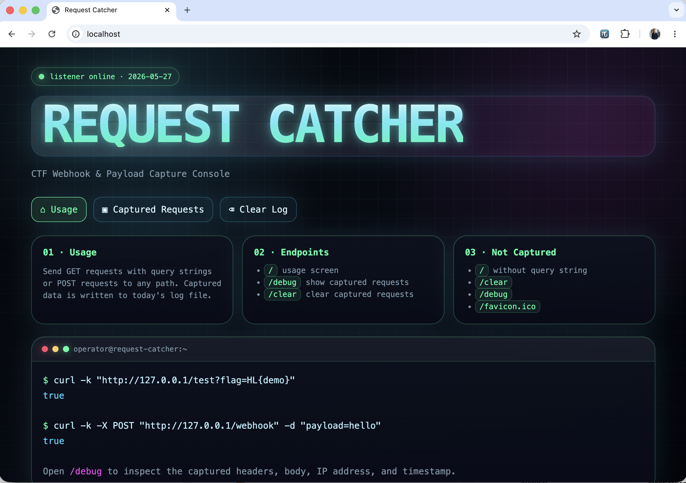

# Alpine Python Flask HTTP Request Catcher
## Introduction
This image is providing an http echo request service. It will store requests in a text file and load requests from there if the user clicks on /debug. Thus, one can observe multiple log entries. 



## Usage
* xss landing page
* api request monitoring

## Purpose
Give cyber security specialists a `landing page` for collecting cookies in a xss scenario. 

## UUID
This docker was created for the Hacking-Lab CTF framework. Thus, you will find the UUID files (dynamic flag deployment). Ignore them in your own setup

## Docker Hub
https://hub.docker.com/repository/docker/hackinglab/alpine-python-flask-http-request-catcher

```bash
services:
  alpine-python-flask-http-request-catcher:
    build: .
    image: hackinglab/alpine-python-flask-http-request-catcher:3.2
    ports:
      - 80:8080
```


